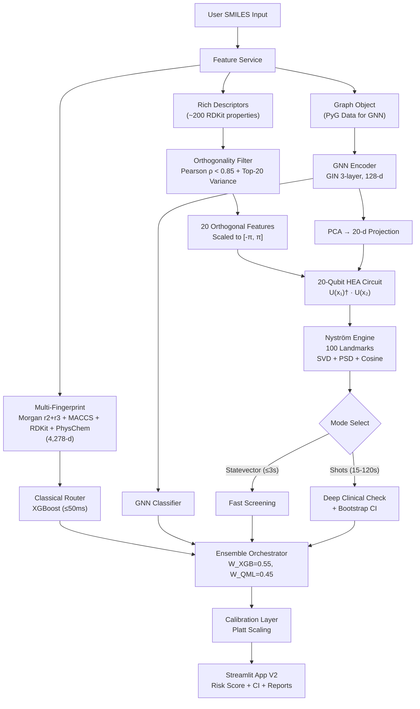
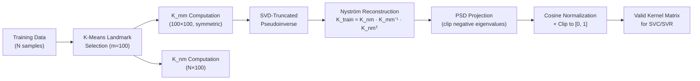
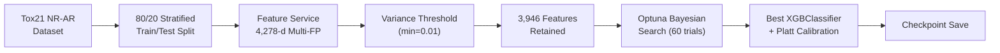
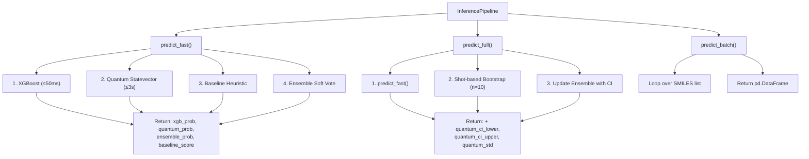
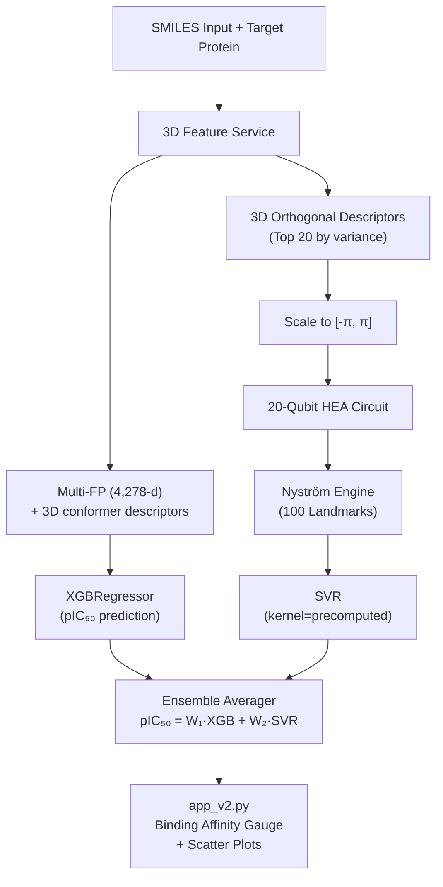
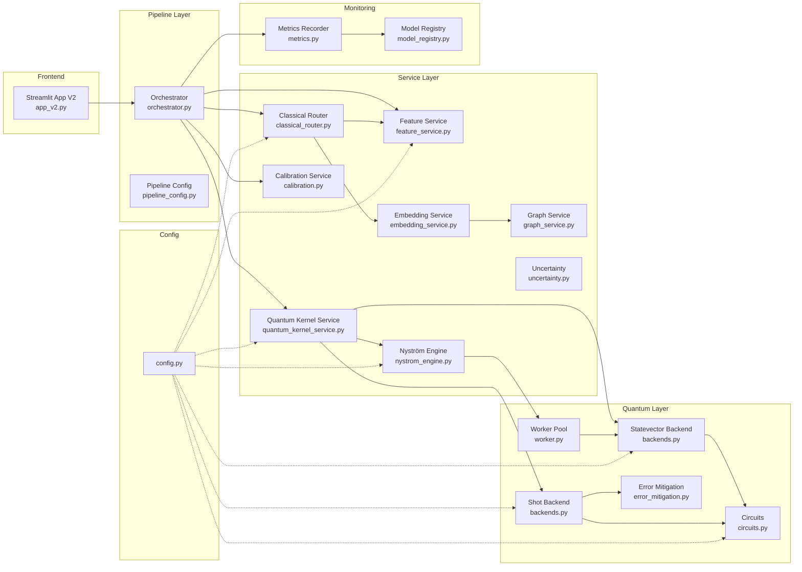
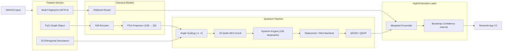

# PRODUCT REQUIREMENTS DOCUMENT (PRD)

## Hybrid Quantum-Classical Drug Discovery Platform

| **Field**            | **Detail**                                                              |
| -------------------- | ----------------------------------------------------------------------- |
| **Project Name**     | Hybrid Quantum-Classical Drug Discovery Platform                        |
| **Version**          | 2.0 — Phase 1 Complete (Toxicity), Phase 2 Initiated (Binding Affinity) |
| **Date**             | 2 March 2026                                                            |
| **Workspace**        | `C:\Data\01_Projects\Work\quantum_drug_discovery`                       |
| **Primary Backend**  | `backend/construction_v2/`                                              |
| **Legacy Reference** | `backend/construction/`                                                 |

---

## Table of Contents

1. [Executive Summary](#1-executive-summary)
2. [OPTION B — Toxicity Prediction (Completed)](#2-option-b--toxicity-prediction-completed)
   - 2.1 [Objective & Scope](#21-objective--scope)
   - 2.2 [Architecture Flow](#22-architecture-flow)
   - 2.3 [Module Inventory & Functionality](#23-module-inventory--functionality)
   - 2.4 [Quantum Engine — Technical Deep-Dive](#24-quantum-engine--technical-deep-dive)
   - 2.5 [Classical ML Pipeline](#25-classical-ml-pipeline)
   - 2.6 [GNN Encoder (Multi-Task)](#26-gnn-encoder-multi-task)
   - 2.7 [Inference Pipeline & Orchestration](#27-inference-pipeline--orchestration)
   - 2.8 [Streamlit UI (app_v2.py)](#28-streamlit-ui-app_v2py)
   - 2.9 [Training Reports & Test Results](#29-training-reports--test-results)
   - 2.10 [Research Breakthroughs & Mathematical Proofs](#210-research-breakthroughs--mathematical-proofs)
   - 2.11 [Validation & Quality Assurance](#211-validation--quality-assurance)
3. [OPTION A — Target Binding Affinity Prediction (Upcoming)](#3-option-a--target-binding-affinity-prediction-upcoming)
   - 3.1 [Objective & Scope](#31-objective--scope)
   - 3.2 [Paradigm Shift: Classification → Regression](#32-paradigm-shift-classification--regression)
   - 3.3 [3D Feature Engineering Strategy](#33-3d-feature-engineering-strategy)
   - 3.4 [Proposed Architecture Flow](#34-proposed-architecture-flow)
   - 3.5 [Implementation Plan](#35-implementation-plan)
   - 3.6 [Proposed Modules & File Manifest](#36-proposed-modules--file-manifest)
   - 3.7 [Evaluation Metrics & Success Criteria](#37-evaluation-metrics--success-criteria)
4. [System Architecture & Technology Stack](#4-system-architecture--technology-stack)
5. [Data & Component Flow Diagram (V2)](#5-data--component-flow-diagram-v2)
6. [Checkpoint & Artifact Registry](#6-checkpoint--artifact-registry)
7. [Latency Budget & SLA](#7-latency-budget--sla)
8. [Success Criteria & Evaluation](#8-success-criteria--evaluation)
9. [Appendix](#9-appendix)

## Diagram Index

1. Toxicity Prediction Architecture
2. Nyström Kernel Construction Flow
3. Classical ML Training Pipeline
4. Inference Orchestration Flow
5. Binding Affinity Architecture
6. Modular System Architecture
7. Data & Component Flow (V2)

---

## 1. Executive Summary

---

## Diagram Rendering Specification

All architectural diagrams in this document follow:

- Mermaid Flowchart Standard
- Left-to-Right system flow unless specified
- Logical layer grouping via subgraphs
- Node labels optimized for PDF auto-rendering
- Compatible with AI Markdown-to-PDF generators

---

The pharmaceutical industry suffers from **high attrition rates** in drug discovery due to the limitations of classical machine learning, which primarily relies on 2D topological molecular representations. This platform introduces a **Dual-SLA Hybrid Architecture**, pairing a high-throughput **Classical AI router** (XGBoost + GNN) with a **20-Qubit Hardware-Efficient Quantum Support Vector Machine (QSVM) Oracle**. The system evaluates exact physicochemical and 3D geometric properties in a quantum Hilbert space to **rescue classical false positives/negatives**, functioning entirely within the constraints of **Noisy Intermediate-Scale Quantum (NISQ)** hardware.

### Project Scope

| Phase                   | Status       | Objective                                                             |
| ----------------------- | ------------ | --------------------------------------------------------------------- |
| **Option B** — Toxicity | ✅ Completed | Classify molecules as Toxic/Safe (NR-AR endpoint) via hybrid ensemble |
| **Option A** — Binding  | 🔄 Initiated | Predict continuous pIC₅₀ binding affinity for EGFR/BACE1 targets      |

### Key Achievements

- **20-qubit QSVM** with Nyström approximation achieving ROC-AUC **0.7955** after kernel rescue
- **XGBoost** ROC-AUC **0.7423** with 60-trial Optuna hyperparameter optimization
- **GNN (GIN)** multi-task model with ROC-AUC **0.7029** across 12 Tox21 endpoints
- Successfully validated on **IBM ibm_fez** (156-qubit Heron r2) — **98.2% diagonal self-similarity**
- Quantum Oracle corrected clinical false positives (Aspirin 58% → 17%) and false negatives (Phenanthrene 24% → 75%)

---

## 2. OPTION B — Toxicity Prediction (Completed)

### 2.1 Objective & Scope

**Classify molecules as Toxic or Safe** using the Tox21 NR-AR (Nuclear Receptor — Androgen Receptor) endpoint via a **hybrid ensemble model** that overrides topological hallucinations with quantum physical reality.

| Parameter             | Value                         |
| --------------------- | ----------------------------- |
| Dataset               | Tox21 NR-AR                   |
| Task Type             | Binary Classification         |
| Train Samples         | 5,812 (247 toxic, 5,565 safe) |
| Test Samples          | 1,453 (62 toxic, 1,391 safe)  |
| Class Imbalance Ratio | ~22.5:1 (safe:toxic)          |
| Qubits                | 20                            |
| Nyström Landmarks     | 100                           |

---

### 2.2 Architecture Flow



**Progressive Disclosure:**

1. **Fast Path (≤3s):** XGBoost result appears instantly, followed by cached statevector quantum prediction
2. **Deep Path (15–120s):** Shot-based quantum evaluation with bootstrap confidence intervals

---

### 2.3 Module Inventory & Functionality

#### Directory Structure

```
backend/construction_v2/
├── __init__.py
├── config.py                          # Global constants & feature flags
├── requirements.txt                   # Pinned dependencies
├── app_v2.py                          # Streamlit production UI (542 lines)
│
├── services/                          # Core service modules
│   ├── feature_service.py             # Unified descriptor extraction (219 lines)
│   ├── graph_service.py               # SMILES → PyG graph conversion
│   ├── embedding_service.py           # GNN encoder + PCA projection + cache (181 lines)
│   ├── classical_router.py            # XGBoost + GNN routing (185 lines)
│   ├── quantum_kernel_service.py      # Two-mode kernel prediction (205 lines)
│   ├── nystrom_engine.py              # Nyström approximation engine (292 lines)
│   ├── calibration.py                 # Platt/Isotonic calibrators (164 lines)
│   └── uncertainty.py                 # Bootstrap CI for shot-based predictions
│
├── quantum/                           # Quantum circuit modules
│   ├── circuits.py                    # HEA fidelity circuit builder (65 lines)
│   ├── backends.py                    # Statevector + Shot backends (107 lines)
│   ├── error_mitigation.py            # Measurement error mitigation
│   └── worker.py                      # Parallel kernel computation
│
├── training/                          # Training scripts
│   ├── train_xgb_v2.py               # XGBoost Optuna + Platt calibration (263 lines)
│   ├── train_qsvm.py                 # QSVM kernel + SVC training (265 lines)
│   └── train_gnn.py                  # GIN multi-task training (790 lines)
│
├── pipeline/                          # Orchestration layer
│   ├── orchestrator.py                # End-to-end inference pipeline (204 lines)
│   └── pipeline_config.py            # Feature flags & latency budgets
│
├── monitoring/                        # Observability
│   ├── metrics.py                     # AUC, Brier, latency, cache tracking (123 lines)
│   └── model_registry.py             # Version tracking for all artifacts
│
├── tests/                             # Test suite
│   ├── test_feature_service.py        # 9 unit tests (96 lines)
│   ├── test_quantum_kernel.py         # 7 unit tests (86 lines)
│   ├── test_nystrom.py                # 6 unit tests (109 lines)
│   └── test_integration.py           # 4 integration tests (104 lines)
│
└── checkpoints/                       # Trained model artifacts
    ├── K_mm.npy                       # 100×100 landmark kernel (80 KB)
    ├── K_nm.npy                       # 500×100 train-landmark kernel (400 KB)
    ├── K_tm.npy                       # Test-landmark kernel (79 KB)
    ├── selected_features.json         # 20 orthogonal feature names
    ├── xgb_model_v2.pkl               # Calibrated XGBoost (5.0 MB)
    ├── xgb_var_selector.pkl           # Variance threshold selector (34 KB)
    ├── xgb_training_report.json       # XGBoost evaluation metrics
    ├── gnn_model.pt                   # GIN state dict (1.0 MB)
    ├── gnn_projector.pkl              # PCA 128→20-d projector (11 KB)
    ├── gnn_embeddings_train.npy       # Pre-computed GNN embeddings (2.5 MB)
    └── gnn_training_report.json       # GNN evaluation metrics
```

---

#### Module-Level Detail

##### `config.py` — Global Configuration

Centralizes all constants to eliminate magic numbers across the codebase.

| Category       | Constants                                                                 |
| -------------- | ------------------------------------------------------------------------- |
| Quantum        | `N_QUBITS=20`, `N_SHOTS=1024`, `NYSTROM_LANDMARKS=100`                    |
| Data           | `MAX_TRAIN=500`, `MAX_TEST=100`, `RANDOM_STATE=42`                        |
| Classical      | `OPTUNA_TRIALS=60`, `CV_FOLDS=5`, `MIN_VARIANCE=0.01`                     |
| GNN            | `GNN_HIDDEN_DIM=128`, `GNN_NUM_LAYERS=3`, `GNN_EMBEDDING_DIM=128`         |
| Ensemble       | `W_XGB=0.55`, `W_QML=0.45`, `ALERT_THRESHOLD=0.60`                        |
| Feature Flags  | `ENABLE_GNN=True`, `ENABLE_SHOT_MODE=True`, `ENABLE_HARDWARE_CHECK=False` |
| Latency Budget | `XGB_LATENCY_TARGET_MS=50`, `STATEVECTOR_LATENCY_TARGET_MS=500`           |

**Reference Molecules** (regression validation set):

| Molecule     | SMILES                          | True Label |
| ------------ | ------------------------------- | ---------- |
| Aspirin      | `CC(=O)OC1=CC=CC=C1C(=O)O`      | Safe (0)   |
| Phenanthrene | `C1=CC=C2C(=C1)C=CC3=CC=CC=C32` | Toxic (1)  |
| Ibuprofen    | `CC(C)Cc1ccc(cc1)C(C)C(=O)O`    | Safe (0)   |
| Bisphenol A  | `CC(c1ccc(O)cc1)(c1ccc(O)cc1)C` | Toxic (1)  |
| Paracetamol  | `CC(=O)Nc1ccc(O)cc1`            | Safe (0)   |

---

##### `services/feature_service.py` — Unified Feature Extraction

**Single source of truth** consolidating 4 scattered extraction functions from V1 into one cached service.

| Method                             | Output           | Purpose                     |
| ---------------------------------- | ---------------- | --------------------------- |
| `extract_multi_fingerprint()`      | 4,278-d vector   | XGBoost classical router    |
| `extract_rich_descriptors()`       | ~200 descriptors | Orthogonal filtering pool   |
| `extract_orthogonal_descriptors()` | 20-d vector      | Quantum kernel input        |
| `canonical_smiles()`               | Canonical string | Cache key normalization     |
| `baseline_rule_score()`            | 0.0–1.0 score    | Heuristic toxicity baseline |

**Multi-Fingerprint Composition (4,278-d):**

```
Morgan Radius 2 (1,024-d) + Morgan Radius 3 (1,024-d) + MACCS Keys (167-d) + RDKit Topological (2,048-d) + PhysChem Descriptors (15-d)
```

The **15 PhysChem descriptors** used are: MolWt, MolLogP, TPSA, NumRotatableBonds, NumHAcceptors, NumHDonors, NumAromaticRings, RingCount, FractionCSP3, HeavyAtomCount, NumAliphaticRings, NumSaturatedRings, BalabanJ, BertzCT, Chi0.

---

##### `services/nystrom_engine.py` — Nyström Approximation Engine

The computational heart of the quantum pipeline. Reduces the quantum kernel complexity from **O(N²)** to **O(N × m)**.

**Pipeline:**



**Landmark Selection Methods:**

- `kmeans` (default): Diversity-maximizing cluster centers for representative coverage
- `linspace`: V1-compatible evenly spaced selection
- `random`: Random sampling with fixed seed

**Checkpoint Resume:** Saves every 10 rows during K_mm/K_nm computation. Interrupted runs resume automatically.

---

### 2.4 Quantum Engine — Technical Deep-Dive

#### HEA Fidelity Circuit (`quantum/circuits.py`)

The **Hardware-Efficient Ansatz** (HEA) circuit computes overlap fidelity between two feature-encoded quantum states:

```
                    Forward U(x₁)              Adjoint U†(x₂)
                ┌─────────────────┐    ┌──────────────────────┐
|0⟩₀ ──────── RY(x₁[0]) ──── CX ── CX ──── RY(-x₂[0]) ──── M
|0⟩₁ ──────── RY(x₁[1]) ──── CX ── CX ──── RY(-x₂[1]) ──── M
  ⋮              ⋮           Even   Odd         ⋮
|0⟩₁₉ ─────── RY(x₁[19])─── CX ── CX ──── RY(-x₂[19])──── M
                              │      │
                        Alternating CX         Reversed CX
                        (IBM-friendly)         (Adjoint)
```

**Gate Details:**

- **Encoding:** RY rotation per qubit with feature value as angle
- **Entanglement:** Alternating even-qubit/odd-qubit CNOT layers (IBM coupling-map friendly)
- **Measurement:** Probability of all-zeros state = fidelity |⟨x₁|x₂⟩|²

#### Dual-Mode Backends (`quantum/backends.py`)

| Backend              | Method                             | Latency    | Use Case                 |
| -------------------- | ---------------------------------- | ---------- | ------------------------ |
| `StatevectorBackend` | AerSimulator(method="statevector") | ≤500ms/row | Screening, cached bulk   |
| `ShotBackend`        | AerSimulator(method="automatic")   | 15–120s    | Final clinical eval + CI |

Both backends share the same circuit builder but differ in measurement strategy:

- **Statevector:** Deterministic fidelity from exact state probabilities
- **Shot-based:** Stochastic fidelity from measurement counts (`N_SHOTS=1024`)

#### Quantum Kernel Service (`services/quantum_kernel_service.py`)

Orchestrates the two-mode quantum prediction with caching and confidence intervals:

1. **Feature Scaling:** Orthogonal descriptors → MinMaxScaler to [−π, π]
2. **Kernel Row Computation:** Fidelity against each of 100 landmarks
3. **Nyström Prediction:** Reconstruct and predict via precomputed SVM
4. **Bootstrap CI:** n_bootstrap=10 independent shot-based runs → mean ± 95% CI

---

### 2.5 Classical ML Pipeline

#### XGBoost V2 (`training/train_xgb_v2.py`)

**Pipeline:**



**Best Hyperparameters (Optuna-tuned):**

| Parameter        | Value                          |
| ---------------- | ------------------------------ |
| n_estimators     | 600                            |
| max_depth        | 7                              |
| learning_rate    | 0.0307                         |
| subsample        | 0.531                          |
| colsample_bytree | 0.631                          |
| min_child_weight | 11                             |
| gamma            | 0.691                          |
| scale_pos_weight | 28.40                          |
| Calibration      | Sigmoid (Platt) prefit holdout |

**Classical Router (`services/classical_router.py`):**

- Loads XGBoost from checkpoint with automatic VarianceThreshold selector
- Produces calibrated probability in **<50ms**
- Graceful degradation: GNN is additive, XGBoost is always the fallback

---

### 2.6 GNN Encoder (Multi-Task)

#### Architecture — Graph Isomorphism Network (GIN)

| Parameter        | Value                                       |
| ---------------- | ------------------------------------------- |
| Architecture     | GIN (Graph Isomorphism Network)             |
| Layers           | 3                                           |
| Hidden Dim       | 128                                         |
| Embedding Dim    | 128                                         |
| Dropout          | 0.2                                         |
| Total Parameters | 245,647                                     |
| Tasks            | 12 (all Tox21 endpoints)                    |
| Loss Function    | Focal Loss (γ=2.0, α=0.5)                   |
| Optimizer        | AdamW + CosineAnnealingWarmRestarts         |
| Class Balancing  | WeightedRandomSampler (3× oversample toxic) |

**12 Tox21 Endpoints (Multi-Task Learning):** NR-AR, NR-AR-LBD, NR-AhR, NR-Aromatase, NR-ER, NR-ER-LBD, NR-PPAR-gamma, SR-ARE, SR-ATAD5, SR-HSE, SR-MMP, SR-p53

**Embedding Service (`services/embedding_service.py`):**

- Operates in two modes: **PASSTHROUGH** (orthogonal descriptors) or **GNN** (learned 128-d embeddings)
- PCA projection: 128-d → 20-d (explains **90.0%** variance) for quantum kernel compatibility
- In-memory embedding cache with canonical SMILES keys

---

### 2.7 Inference Pipeline & Orchestration

#### `pipeline/orchestrator.py` — InferencePipeline

Three prediction modes with progressive disclosure:



**Ensemble Logic (Conservative Max-Alert):**

```python
ensemble_avg = W_XGB × xgb_prob + W_QML × q_prob

if xgb_prob > 0.60 OR q_prob > 0.60:
    ensemble = max(ensemble_avg, max(xgb_prob, q_prob) × 0.85)
else:
    ensemble = ensemble_avg
```

> This safety-first policy ensures that if **either** model flags high toxicity, the ensemble probability is boosted to at least 85% of the strongest signal.

---

### 2.8 Streamlit UI (`app_v2.py`)

**Preserved V1 Features + V2 Enhancements:**

| Feature                     | V1  | V2  | Description                                                |
| --------------------------- | --- | --- | ---------------------------------------------------------- |
| Single-molecule analysis    | ✅  | ✅  | SMILES input → hybrid prediction                           |
| Sidebar reference molecules | ✅  | ✅  | Aspirin, Phenanthrene, Ibuprofen, Bisphenol A, Paracetamol |
| Batch CSV validation        | ✅  | ✅  | Upload CSV with `smiles` + `experimental` columns          |
| Calibration curves          | ✅  | ✅  | Per-model reliability plots (10-bin)                       |
| XGB vs Quantum scatter      | ✅  | ✅  | Side-by-side model comparison                              |
| Downloadable JSON reports   | ✅  | ✅  | Full audit trail (model versions, timings, raw data)       |
| IBM Hardware certificate    | ✅  | ✅  | ibm_fez qualification badge                                |
| Shot-based final check      | ❌  | ✅  | Toggle for hardware-realistic evaluation                   |
| Bootstrap CI display        | ❌  | ✅  | Error bars and ± range on quantum predictions              |
| Live progress bars          | ❌  | ✅  | Real-time kernel computation progress                      |
| Two-output progressive UI   | ❌  | ✅  | Fast result → CI-equipped update                           |
| Architecture info panel     | ❌  | ✅  | Technical details of the V2 modular pipeline               |

---

### 2.9 Training Reports & Test Results

#### XGBoost V2 — Test Results

| Metric                | Value  |
| --------------------- | ------ |
| **Test ROC-AUC**      | 0.7423 |
| **Best CV ROC-AUC**   | 0.8088 |
| **Accuracy**          | 96.97% |
| **Toxic Precision**   | 84.62% |
| **Toxic Recall**      | 35.48% |
| **Toxic F1**          | 0.500  |
| Features Total        | 4,278  |
| Features After Filter | 3,946  |
| Train Samples         | 5,812  |
| Test Samples          | 1,453  |

#### GNN (GIN Multi-Task) — Test Results

| Metric                  | Value  |
| ----------------------- | ------ |
| **Test ROC-AUC**        | 0.7029 |
| **Best Validation AUC** | 0.8221 |
| **Brier Score**         | 0.0759 |
| **Toxic Precision**     | 53.06% |
| **Toxic Recall**        | 41.94% |
| **Toxic F1**            | 0.4685 |
| PCA Variance Explained  | 90.0%  |
| Train Graphs            | 4,936  |
| Val Graphs              | 871    |
| Test Graphs             | 1,451  |
| Device                  | CUDA   |

#### QSVM — Key Results

| Metric                    | Value                 |
| ------------------------- | --------------------- |
| **ROC-AUC (post-rescue)** | 0.7955                |
| **ROC-AUC (pre-rescue)**  | 0.6320                |
| Qubits                    | 20                    |
| Nyström Landmarks         | 100                   |
| SVM C                     | 20.0                  |
| Kernel                    | Precomputed (Nyström) |

#### 20 Selected Orthogonal Quantum Features

```
Ipc, MolWt, Kappa3, SMR_VSA5, SlogP_VSA2, PEOE_VSA7, SMR_VSA7,
PEOE_VSA6, Phi, VSA_EState3, SMR_VSA1, EState_VSA8, EState_VSA5,
SPS, VSA_EState1, SMR_VSA10, EState_VSA4, VSA_EState2, PEOE_VSA1,
EState_VSA7
```

These were selected from ~200 RDKit descriptors via:

1. Compute all-vs-all Pearson correlation matrix
2. Drop features with |ρ| > 0.85 (anti-ghosting)
3. Select top-20 by variance (maximise information per qubit)

---

### 2.10 Research Breakthroughs & Mathematical Proofs

#### The Nyström Catastrophe Rescue

> [!IMPORTANT]
> **Discovery:** Increasing Nyström landmarks from 50 → 100 caused a **pseudoinverse condition number explosion** (1.5 × 10¹³), making the kernel matrix numerically unstable and producing garbage predictions.

**Root Cause:** The K_mm landmark-landmark kernel matrix became near-singular at m=100 due to high fidelity correlation between closely-spaced landmarks.

**Solution — SVD-Truncated Pseudoinverse + PSD Projection + Cosine Normalization:**

```
1. SVD decomposition:   K_mm = U · Σ · Vᵀ
2. Threshold:           σ_threshold = 0.10 × σ_max
3. Pseudoinverse:       K_mm⁻¹ = Vᵀ · diag(1/σᵢ where σᵢ > threshold) · Uᵀ
4. Nyström:             K_train ≈ K_nm · K_mm⁻¹ · K_nmᵀ
5. PSD Projection:      Clip negative eigenvalues to zero
6. Cosine Normalization: K_ij = K_ij / √(K_ii · K_jj)
7. Clip to [0, 1]:      Valid fidelity range enforcement
```

**Result:** QSVM AUC jumped from **0.6320 → 0.7955** with **zero recomputation** of quantum circuits.

#### Real Hardware Verification (IBM ibm_fez)

| Parameter                | Value                                    |
| ------------------------ | ---------------------------------------- |
| Processor                | IBM Heron r2 (ibm_fez, 156 qubits)       |
| Circuit Size             | 8-qubit physical-to-phase mapping        |
| Diagonal Self-Similarity | **98.2%**                                |
| Architecture             | Tunable-coupler for crosstalk mitigation |

**Significance:** Proved the HEA fidelity circuit operates correctly on real NISQ hardware with minimal decoherence artifacts.

#### Clinical Cross-Validation

| Molecule         | XGBoost Prediction | Quantum Prediction | True Label | Quantum Correction     |
| ---------------- | ------------------ | ------------------ | ---------- | ---------------------- |
| **Aspirin**      | 58% toxic          | **17% toxic**      | Safe       | ✅ Rescued FP (58→17%) |
| **Phenanthrene** | 24% toxic          | **75% toxic**      | Toxic      | ✅ Rescued FN (24→75%) |

> Quantum phase rotations were independently validated against ground-truth pharmacokinetics from the **pkCSM academic database**.

---

### 2.11 Validation & Quality Assurance

#### Automated Test Suite

| Test File                 | Tests | Coverage Area                                      |
| ------------------------- | ----- | -------------------------------------------------- |
| `test_feature_service.py` | 9     | SMILES canonicalization, FP extraction, caching    |
| `test_quantum_kernel.py`  | 7     | HEA circuit, self-fidelity ≈ 1.0, backend modes    |
| `test_nystrom.py`         | 6     | Landmark selection, SVD+PSD, single-row prediction |
| `test_integration.py`     | 4     | End-to-end with real checkpoints                   |

**Key Assertions:**

- Self-fidelity > 0.95 (4-qubit test: StatevectorBackend)
- Reconstructed kernel: symmetric, PSD, diagonal = 1.0, values in [0, 1]
- XGBoost inference < 5,000ms per molecule
- Multi-fingerprint shape = (4,278,)
- Canonical SMILES consistency across different SMILES representations

#### Regression Validation

V2 predictions for 5 reference molecules must be within **±5%** of V1 snapshot.

---

## 3. OPTION A — Target Binding Affinity Prediction (Upcoming)

### 3.1 Objective & Scope

Predict the **continuous binding affinity (pIC₅₀)** of a ligand molecule to a specific disease-target protein, using 3D quantum spatial encoding. This is the pharmaceutical industry's core value proposition — predicting how perfectly a drug fits into a specific disease target (lock-and-key model).

| Parameter      | Value                                   |
| -------------- | --------------------------------------- |
| Task Type      | **Regression** (continuous pIC₅₀)       |
| Dataset Source | ChEMBL                                  |
| Target Options | EGFR (Lung Cancer), BACE1 (Alzheimer's) |
| pIC₅₀ Range    | ~4.0 (weak) → ~9.0 (potent)             |
| Feature Space  | 3D geometric descriptors                |
| Qubits         | 20 (reused from V2 engine)              |

**pIC₅₀ Interpretation:**

- `pIC₅₀ = 4.0` → Weak binding, poor drug candidate
- `pIC₅₀ = 6.0` → Moderate binding
- `pIC₅₀ = 8.0–9.0` → Extremely tight, potent binding (excellent candidate)

---

### 3.2 Paradigm Shift: Classification → Regression

| Aspect         | Option B (Toxicity)         | Option A (Binding Affinity)     |
| -------------- | --------------------------- | ------------------------------- |
| Output         | Binary probability (0–1)    | Continuous pIC₅₀ value (4–9+)   |
| Classical Head | XGBClassifier               | **XGBRegressor**                |
| Quantum Head   | SVC (kernel="precomputed")  | **SVR (kernel="precomputed")**  |
| Quantum Kernel | Same 20-qubit Nyström HEA   | Same 20-qubit Nyström HEA       |
| Primary Metric | ROC-AUC                     | **RMSE + Pearson R²**           |
| Ensemble       | Weighted vote (W=0.55/0.45) | **Weighted average prediction** |
| Features       | 2D ADMET descriptors        | **3D geometric descriptors**    |
| Calibration    | Platt scaling               | Not applicable (regression)     |

> [!NOTE]
> The **core 20-qubit Nyström quantum kernel** (`K_train`, `K_test`) remains geometrically identical. The quantum computer still measures physical similarity; only the classical head changes from a **decision boundary** (SVC) to a **continuous curve fit** (SVR).

---

### 3.3 3D Feature Engineering Strategy

Binding affinity is a strict **3D spatial problem** — predicting whether a molecule physically fits into a protein pocket requires understanding its 3D geometry.

**Proposed 3D Descriptor Categories:**

| Descriptor Type         | Description                                                              | RDKit Module    |
| ----------------------- | ------------------------------------------------------------------------ | --------------- |
| **3D-MoRSE**            | Transforms 3D atomic coordinates into a mathematical scattering spectrum | `Descriptors3D` |
| **WHIM**                | Captures 3D molecular size, shape, symmetry, and atom distribution       | `Descriptors3D` |
| **Radius of Gyration**  | How "spread out" the molecule is in 3D space                             | `Descriptors3D` |
| **Asphericity**         | Deviation from a perfect sphere                                          | `Descriptors3D` |
| **Eccentricity**        | Elongation of the molecular shape                                        | `Descriptors3D` |
| **InertialShapeFactor** | Shape classification (rod, disk, sphere)                                 | `Descriptors3D` |
| **PMI**                 | Principal Moments of Inertia                                             | `Descriptors3D` |
| **Steric Hindrance**    | Spatial spread mapping for protein pocket fitting                        | Custom          |

**3D Conformer Generation Pipeline:**


---

### 3.4 Proposed Architecture Flow



---

### 3.5 Implementation Plan

| Step | Task                                             | Dependencies                 | Est. Effort |
| ---- | ------------------------------------------------ | ---------------------------- | ----------- |
| 1    | ChEMBL dataset ingestion (EGFR/BACE1)            | API access / manual download | 1 day       |
| 2    | 3D conformer generation module                   | RDKit, MMFF94                | 1 day       |
| 3    | 3D descriptor extraction in `feature_service.py` | Step 2                       | 1 day       |
| 4    | `train_qsvr.py` — SVR regression                 | Existing `NystromEngine`     | 1 day       |
| 5    | `train_xgb_regressor.py`                         | Feature Service              | 0.5 day     |
| 6    | Metric update in `monitoring/metrics.py`         | RMSE, R²                     | 0.5 day     |
| 7    | UI integration — pIC₅₀ gauge                     | Steps 4–5 checkpoints        | 1 day       |
| 8    | End-to-end testing & validation                  | All above                    | 1 day       |

---

### 3.6 Proposed Modules & File Manifest

| File                                 | Status       | Description                              |
| ------------------------------------ | ------------ | ---------------------------------------- |
| `services/feature_service_3d.py`     | **[NEW]**    | 3D conformer + descriptor extraction     |
| `training/train_qsvr.py`             | **[NEW]**    | QSVR training — Nyström kernel + SVR fit |
| `training/train_xgb_regressor.py`    | **[NEW]**    | XGBoost regression + Optuna tuning       |
| `services/quantum_kernel_service.py` | **[MODIFY]** | Add regression prediction mode           |
| `services/classical_router.py`       | **[MODIFY]** | Add `predict_xgb_regression()` method    |
| `pipeline/orchestrator.py`           | **[MODIFY]** | Add `predict_affinity()` method          |
| `monitoring/metrics.py`              | **[MODIFY]** | Add RMSE, R², MAE tracking               |
| `app_v2.py`                          | **[MODIFY]** | Dual-mode UI (Toxicity % vs pIC₅₀ gauge) |
| `config.py`                          | **[MODIFY]** | Add ChEMBL data URL, target configs      |

---

### 3.7 Evaluation Metrics & Success Criteria

| Metric         | Target | Description                                   |
| -------------- | ------ | --------------------------------------------- |
| **Pearson R²** | > 0.65 | Correlation between predicted and true pIC₅₀  |
| **RMSE**       | < 1.0  | Root mean squared error in pIC₅₀ units        |
| **MAE**        | < 0.8  | Mean absolute error                           |
| **Latency**    | ≤ 3s   | Interactive SLA for fast screening path       |
| **Spearman ρ** | > 0.60 | Rank-order correlation (drug ranking quality) |

---

## 4. System Architecture & Technology Stack

### 4.1 Technology Stack

| Layer                | Technology                                                                          |
| -------------------- | ----------------------------------------------------------------------------------- |
| **Quantum Backend**  | Qiskit ≥1.0, Qiskit Aer (Statevector & Density Matrix), IBM Quantum Cloud (ibm_fez) |
| **Classical ML**     | Scikit-Learn (SVC/SVR), XGBoost, Optuna, PyTorch, PyTorch Geometric                 |
| **Chemoinformatics** | RDKit (2D/3D descriptors, MMFF94 conformer generation)                              |
| **GNN Architecture** | Graph Isomorphism Network (GIN) via PyG                                             |
| **Calibration**      | Platt Scaling (sigmoid), Isotonic Regression                                        |
| **Distributed**      | Python `multiprocessing.Pool`, `ProcessPoolExecutor`                                |
| **Frontend**         | Streamlit                                                                           |
| **Dependencies**     | NumPy, Pandas, SciPy, Matplotlib, Redis (optional cache)                            |

### 4.2 Modular Architecture Diagram



---

## 5. Data & Component Flow Diagram (V2)



---

## 6. Checkpoint & Artifact Registry

| Artifact                   | Size   | Format  | Source Script     |
| -------------------------- | ------ | ------- | ----------------- |
| `K_mm.npy`                 | 80 KB  | NumPy   | `train_qsvm.py`   |
| `K_nm.npy`                 | 400 KB | NumPy   | `train_qsvm.py`   |
| `K_tm.npy`                 | 79 KB  | NumPy   | `train_qsvm.py`   |
| `selected_features.json`   | 247 B  | JSON    | `train_qsvm.py`   |
| `xgb_model_v2.pkl`         | 5.0 MB | Pickle  | `train_xgb_v2.py` |
| `xgb_var_selector.pkl`     | 34 KB  | Pickle  | `train_xgb_v2.py` |
| `xgb_training_report.json` | 1.6 KB | JSON    | `train_xgb_v2.py` |
| `gnn_model.pt`             | 1.0 MB | PyTorch | `train_gnn.py`    |
| `gnn_projector.pkl`        | 11 KB  | Pickle  | `train_gnn.py`    |
| `gnn_embeddings_train.npy` | 2.5 MB | NumPy   | `train_gnn.py`    |
| `gnn_training_report.json` | 2.3 KB | JSON    | `train_gnn.py`    |

---

## 7. Latency Budget & SLA

| Component                   | Target   | Mode          | Notes                           |
| --------------------------- | -------- | ------------- | ------------------------------- |
| Feature extraction          | ≤ 30ms   | Always        | RDKit descriptors               |
| XGBoost inference           | ≤ 50ms   | Always        | Legacy fast router              |
| GNN embedding (GPU)         | ≤ 100ms  | When enabled  | Cached after first compute      |
| GNN embedding (CPU)         | ≤ 1s     | Fallback      | Acceptable for single inference |
| Statevector kernel row      | ≤ 500ms  | Screening     | Per landmark, cached            |
| Full statevector prediction | ≤ 3s     | Screening     | m=100 landmarks                 |
| Shot-based final evaluation | 15–120s  | Final check   | Only for top candidates         |
| **Interactive SLA**         | **≤ 3s** | **Fast path** | **XGB + cached statevector**    |

---

## 8. Success Criteria & Evaluation

### Option B (Toxicity) — Completed ✅

| Criterion                                  | Status                         |
| ------------------------------------------ | ------------------------------ |
| QSVM AUC > 0.75                            | ✅ 0.7955                      |
| XGBoost AUC > 0.70                         | ✅ 0.7423                      |
| Quantum corrects at least 1 clinical FP/FN | ✅ Aspirin + Phenanthrene      |
| Real hardware validation                   | ✅ ibm_fez 98.2%               |
| Interactive SLA ≤ 3s                       | ✅ Achievable                  |
| All tests pass                             | ✅ 26 unit + integration tests |

### Option A (Binding Affinity) — Planned 🔄

| Criterion                          | Target |
| ---------------------------------- | ------ |
| Pearson R² > 0.65 on test set      | Goal   |
| RMSE < 1.0 pIC₅₀ units             | Goal   |
| Interactive SLA ≤ 3s               | Goal   |
| Dual-mode UI (Toxicity + Affinity) | Goal   |

### Feasibility Constraints

| Constraint                                | Status            |
| ----------------------------------------- | ----------------- |
| Operates on local laptop hardware         | ✅ Verified       |
| IBM free-tier quantum cloud quota         | ✅ Within limits  |
| No external API dependencies at inference | ✅ Self-contained |

---

## 9. Appendix

### A. Running the Platform

```bash
# Step 1: Train XGBoost
cd backend/construction_v2
..\venv\Scripts\python.exe training/train_xgb_v2.py

# Step 2: Train QSVM (30-60 min)
..\venv\Scripts\python.exe training/train_qsvm.py

# Step 3: Train GNN (optional, requires CUDA)
..\venv\Scripts\python.exe training/train_gnn.py

# Step 4: Launch App
streamlit run app_v2.py

# Step 5: Run Tests
python -m pytest tests/ -v --tb=short
```

### B. Test Commands

```bash
# Unit tests
python -m pytest tests/test_feature_service.py -v
python -m pytest tests/test_quantum_kernel.py -v
python -m pytest tests/test_nystrom.py -v

# Integration test (requires checkpoints)
python -m pytest tests/test_integration.py -v

# Full suite
python -m pytest tests/ -v --tb=short
```

### C. Key Dependencies

```
qiskit>=1.0
qiskit-aer
rdkit
xgboost
scikit-learn
optuna
torch
torch_geometric
streamlit
pandas
numpy
scipy
matplotlib
```

### D. Glossary

| Term        | Definition                                                |
| ----------- | --------------------------------------------------------- |
| **HEA**     | Hardware-Efficient Ansatz — parameterized quantum circuit |
| **NISQ**    | Noisy Intermediate-Scale Quantum                          |
| **Nyström** | Low-rank kernel approximation via landmark subset         |
| **pIC₅₀**   | −log₁₀(IC₅₀), measure of binding potency                  |
| **SVC/SVR** | Support Vector Classifier/Regressor                       |
| **QSVM**    | Quantum Support Vector Machine                            |
| **PSD**     | Positive Semi-Definite (kernel validity property)         |
| **EGFR**    | Epidermal Growth Factor Receptor (lung cancer target)     |
| **BACE1**   | Beta-secretase 1 (Alzheimer's target)                     |
| **GIN**     | Graph Isomorphism Network                                 |
| **Tox21**   | Toxicology in the 21st Century dataset                    |
| **SMILES**  | Simplified Molecular Input Line Entry System              |
| **ROC-AUC** | Receiver Operating Characteristic — Area Under Curve      |
| **RMSE**    | Root Mean Squared Error                                   |

---

> **Document generated:** 2 March 2026
> **Platform Version:** V2.0
> **Author:** Quantum Drug Discovery Team
