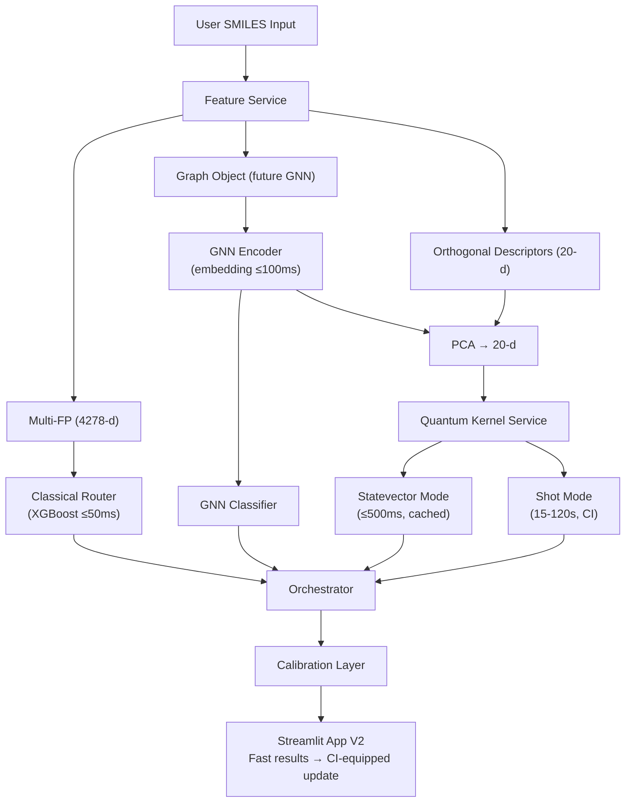
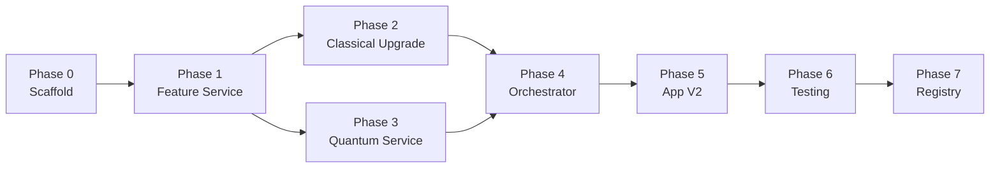

# Hybrid Quantum/Classical Drug Discovery — V2 Upgrade Plan

## Current State

We have 3 working, validated files in `construction/`:

| File | Lines | Role |
|---|---|---|
| [core_engine_shot.py](file:///c:/Data/01_Projects/Work/quantum_drug_discovery/backend/construction/core_engine_shot.py) | 286 | 20-qubit QSVM: orthogonal descriptor extraction → HEA circuit → Nystrom kernel (statevector + shots) → SVC training → AUC evaluation |
| [app_with_validation.py](file:///c:/Data/01_Projects/Work/quantum_drug_discovery/backend/construction/app_with_validation.py) | 571 | Streamlit app: loads XGBoost V2 + QSVM checkpoints, live single-molecule & batch validation, calibration curves, ensemble voting |
| [train_xgb_v2.py](file:///c:/Data/01_Projects/Work/quantum_drug_discovery/backend/construction/train_xgb_v2.py) | 317 | XGBoost training: multi-fingerprint extraction (4278-d) → Optuna search (60 trials) → Platt calibration → checkpoint save |

**Existing checkpoints** (in `construction/checkpoints/`):
`K_mm.npy`, `K_nm.npy`, `K_tm.npy`, `selected_features.json`, `xgb_model_v2.pkl`, `xgb_var_selector.pkl`, `xgb_training_report.json`

Everything runs correctly with real-time inference. The goal is to evolve this into a modular, scalable V2 **without breaking any existing functionality**.

---

## Target `construction_v2/` Directory Layout

```
construction_v2/
├── config.py                    # Global constants, paths, feature flags
├── requirements.txt             # Pinned dependencies
│
├── services/                    # Core service modules
│   ├── __init__.py
│   ├── feature_service.py       # RDKit descriptors + multi-FP extraction
│   ├── graph_service.py         # SMILES → PyG graph (GNN input)
│   ├── embedding_service.py     # GNN encoder + embedding cache
│   ├── classical_router.py      # XGBoost + GNN classifier + stacking
│   ├── quantum_kernel_service.py # Two-mode kernel (statevector/shot)
│   ├── nystrom_engine.py        # Improved Nystrom approximation
│   ├── calibration.py           # Platt/isotonic calibrators for all models
│   └── uncertainty.py           # Bootstrap CI for shot-based predictions
│
├── quantum/                     # Quantum-specific modules
│   ├── __init__.py
│   ├── circuits.py              # HEA circuit builder (from core_engine_shot)
│   ├── backends.py              # StatefulLocalBackend + ShotBackend
│   ├── error_mitigation.py      # Measurement error mitigation + ZNE stubs
│   └── worker.py                # Parallel kernel computation (multiprocessing)
│
├── training/                    # Training scripts
│   ├── __init__.py
│   ├── train_xgb_v2.py          # Preserved from V1 (minor config path fix)
│   ├── train_gnn.py             # GNN training pipeline
│   └── train_qsvm.py            # QSVM kernel build + SVC fit (from core_engine)
│
├── pipeline/                    # Orchestration
│   ├── __init__.py
│   ├── orchestrator.py          # End-to-end inference pipeline
│   └── pipeline_config.py       # Feature flags, latency budgets
│
├── monitoring/                  # Observability
│   ├── __init__.py
│   ├── metrics.py               # AUC, Brier, latency, cache hits
│   └── model_registry.py        # Version tracking for all artifacts
│
├── tests/                       # Test suite
│   ├── __init__.py
│   ├── test_feature_service.py
│   ├── test_quantum_kernel.py
│   ├── test_nystrom.py
│   ├── test_orchestrator.py
│   └── test_integration.py
│
├── checkpoints/                 # Model artifacts (copied from V1)
│   └── (K_mm.npy, K_nm.npy, etc.)
│
└── app_v2.py                    # Streamlit app (upgraded UI)
```

---

## Proposed Changes by Phase

### Phase 0: Foundation & Scaffold

#### [NEW] [config.py](file:///c:/Data/01_Projects/Work/quantum_drug_discovery/backend/construction_v2/config.py)
- All global constants extracted from the 3 existing files: `N_QUBITS=20`, `N_SHOTS=1024`, `NYSTROM_LANDMARKS=100`, `MAX_TRAIN=500`, `MAX_TEST=100`, `CHECKPOINT_DIR`, `PHYSCHEM_DESCS` list, `W_XGB=0.55`, `W_QML=0.45`
- Feature flags: `ENABLE_GNN=False`, `ENABLE_SHOT_MODE=True`, `ENABLE_HARDWARE_CHECK=False`
- Latency budgets: `XGB_LATENCY_TARGET_MS=50`, `GNN_LATENCY_TARGET_MS=100`, `STATEVECTOR_LATENCY_TARGET_MS=500`, `SHOT_LATENCY_TARGET_S=120`
- Data source URL for Tox21

#### [NEW] [requirements.txt](file:///c:/Data/01_Projects/Work/quantum_drug_discovery/backend/construction_v2/requirements.txt)
- Pin all dependencies: `qiskit>=1.0`, `qiskit-aer`, `rdkit`, `xgboost`, `scikit-learn`, `optuna`, `torch`, `torch_geometric` (for future GNN), `streamlit`, `pandas`, `numpy`, `matplotlib`, `redis` (optional)

---

### Phase 1: Feature Service

#### [NEW] [feature_service.py](file:///c:/Data/01_Projects/Work/quantum_drug_discovery/backend/construction_v2/services/feature_service.py)

Consolidates all descriptor extraction from `core_engine_shot.py::extract_rich_descriptors()` and `train_xgb_v2.py::extract_features()` + `app_with_validation.py::extract_xgb_features()` into one service:

```python
class FeatureService:
    """Unified molecular feature extraction."""
    def extract_multi_fingerprint(self, smiles) -> np.ndarray:
        """Morgan r2+r3 + MACCS + RDKit + PhysChem (4278-d) — for XGBoost"""
    def extract_orthogonal_descriptors(self, smiles, selected_features) -> np.ndarray:
        """20 orthogonal descriptors — for quantum kernel"""
    def canonical_smiles(self, smiles) -> str:
        """RDKit canonical SMILES normalization"""
```

> [!NOTE]
> The existing `extract_rich_descriptors`, `extract_xgb_features`, `get_orthogonal_features`, and `extract_features` functions all live in different files with slight variations. This consolidates them into a single source of truth.

#### [NEW] [graph_service.py](file:///c:/Data/01_Projects/Work/quantum_drug_discovery/backend/construction_v2/services/graph_service.py)

```python
class GraphService:
    """SMILES → PyG Data graph object for GNN input."""
    def smiles_to_graph(self, smiles) -> Data:
        """Atom features + bond features + adjacency → PyG Data"""
```

This is a *stub* for Phase 2; it will not be used until the GNN encoder is implemented but establishes the API contract early.

---

### Phase 2: Classical Model Upgrade

#### [NEW] [embedding_service.py](file:///c:/Data/01_Projects/Work/quantum_drug_discovery/backend/construction_v2/services/embedding_service.py)

```python
class EmbeddingService:
    """GNN encoder + in-memory cache."""
    def __init__(self, model_path, device='cpu'):
        self.model = load_gnn(model_path)
        self.cache = {}  # canonical_smiles → embedding
    def get_embedding(self, smiles) -> np.ndarray:
        """Returns 128-d GNN embedding (cached)."""
    def project_for_quantum(self, embedding, n_dims=20) -> np.ndarray:
        """PCA projection from 128-d → 20-d for quantum kernel input."""
```

> [!IMPORTANT]
> Initially this will use a `PASSTHROUGH` mode where the existing orthogonal descriptors serve as "embeddings". The GNN model can be trained and plugged in without changing any downstream code.

#### [NEW] [classical_router.py](file:///c:/Data/01_Projects/Work/quantum_drug_discovery/backend/construction_v2/services/classical_router.py)

```python
class ClassicalRouter:
    """Multi-model classical prediction with calibration."""
    def __init__(self, xgb_model, xgb_selector, gnn_model=None, calibrators=None):
    def predict_xgb(self, smiles) -> float:
        """XGBoost probability (<50ms) — always available"""
    def predict_gnn(self, smiles) -> float:
        """GNN probability (~100ms GPU) — when enabled"""
    def predict_stacked(self, smiles) -> float:
        """Calibrated stacking of XGBoost + GNN"""
```

#### [NEW] [calibration.py](file:///c:/Data/01_Projects/Work/quantum_drug_discovery/backend/construction_v2/services/calibration.py)

```python
class CalibrationService:
    """Manages calibrators for each model."""
    def calibrate(self, model_name, raw_probs, true_labels) -> CalibratedClassifier
    def apply(self, model_name, raw_prob) -> float
    def reliability_curve(self, model_name, probs, labels) -> tuple
```

#### [NEW] [train_gnn.py](file:///c:/Data/01_Projects/Work/quantum_drug_discovery/backend/construction_v2/training/train_gnn.py)

GNN training script:
- GIN architecture (3-layer, hidden_dim=128)
- Tox21 NR-AR dataset via PyG or manual loading
- Saves model weights + embedding PCA projector to `checkpoints/`
- Reports AUC, Brier, comparison vs. XGBoost baseline

---

### Phase 3: Quantum Kernel Service

#### [NEW] [circuits.py](file:///c:/Data/01_Projects/Work/quantum_drug_discovery/backend/construction_v2/quantum/circuits.py)

Extracted from `core_engine_shot.py::build_hea_circuit()`:
```python
def build_hea_circuit(x1, x2, n_qubits=20, measure=True) -> QuantumCircuit:
    """HEA fidelity circuit: U(x1)† U(x2) with alternating CX layers."""
```

#### [NEW] [backends.py](file:///c:/Data/01_Projects/Work/quantum_drug_discovery/backend/construction_v2/quantum/backends.py)

Extracted + extended from `core_engine_shot.py::StatefulLocalBackend`:
```python
class StatevectorBackend:
    """Fast deterministic fidelity (no shots). For screening."""
    def fidelity(self, x1, x2) -> float

class ShotBackend:
    """Shot-based fidelity with measurement counts. For final eval."""
    def __init__(self, n_shots=1024, noise_model=None)
    def fidelity(self, x1, x2) -> float
    def fidelity_with_counts(self, x1, x2) -> dict  # returns {fidelity, counts, raw}
```

#### [NEW] [quantum_kernel_service.py](file:///c:/Data/01_Projects/Work/quantum_drug_discovery/backend/construction_v2/services/quantum_kernel_service.py)

```python
class QuantumKernelService:
    """Two-mode kernel computation with caching."""
    def __init__(self, backend_sv, backend_shot, nystrom_engine):
    def compute_kernel_row(self, x_new, landmarks, mode='statevector') -> np.ndarray
    def predict(self, smiles, mode='statevector') -> dict:
        """Returns {probability, mode, latency, confidence_interval}"""
    def predict_with_ci(self, smiles, n_bootstrap=10) -> dict:
        """Shot-based prediction with bootstrap CI."""
```

#### [NEW] [nystrom_engine.py](file:///c:/Data/01_Projects/Work/quantum_drug_discovery/backend/construction_v2/services/nystrom_engine.py)

Refactored from `core_engine_shot.py::compute_nystrom_stateful()`:
```python
class NystromEngine:
    """Improved Nystrom with k-means landmarks and caching."""
    def __init__(self, checkpoint_dir):
    def select_landmarks(self, X_train, m, method='kmeans') -> np.ndarray
    def compute_K_mm(self, landmarks, backend) -> np.ndarray
    def compute_K_nm(self, X_train, landmarks, backend) -> np.ndarray
    def reconstruct_kernel(self, K_mm, K_nm) -> tuple:
        """SVD + PSD + cosine normalization → (K_train, K_mm_inv, diag_train)"""
    def predict_single(self, x_new_kernel_row, K_mm_inv, K_nm, diag_train, svm) -> float
```

#### [NEW] [worker.py](file:///c:/Data/01_Projects/Work/quantum_drug_discovery/backend/construction_v2/quantum/worker.py)

```python
class KernelWorkerPool:
    """Parallel kernel computation using multiprocessing."""
    def __init__(self, n_workers=4, backend_class=StatevectorBackend):
    def compute_rows_parallel(self, X_data, landmarks, start_row, end_row) -> np.ndarray
    def compute_matrix_parallel(self, X_A, X_B, symmetric=False) -> np.ndarray
```

> [!NOTE]
> Uses `multiprocessing.Pool` rather than Celery initially. Each worker instantiates its own `AerSimulator` to avoid serialization issues. Celery/Dask optional upgrade later.

#### [NEW] [error_mitigation.py](file:///c:/Data/01_Projects/Work/quantum_drug_discovery/backend/construction_v2/quantum/error_mitigation.py)

```python
class ErrorMitigation:
    """Measurement error mitigation for shot-based runs."""
    def build_calibration_matrix(self, backend, n_qubits) -> np.ndarray
    def mitigate_counts(self, raw_counts, cal_matrix) -> dict
```

#### [NEW] [uncertainty.py](file:///c:/Data/01_Projects/Work/quantum_drug_discovery/backend/construction_v2/services/uncertainty.py)

```python
class UncertaintyEstimator:
    """Bootstrap CI for shot-based predictions."""
    def bootstrap_prediction(self, smiles, quantum_service, n_repeats=10) -> dict:
        """Returns {mean, std, ci_lower, ci_upper, raw_probs}"""
```

---

### Phase 4: Orchestrator

#### [NEW] [orchestrator.py](file:///c:/Data/01_Projects/Work/quantum_drug_discovery/backend/construction_v2/pipeline/orchestrator.py)

```python
class InferencePipeline:
    """End-to-end prediction pipeline with progressive disclosure."""
    def __init__(self, feature_svc, classical_router, quantum_svc, config):
    def predict_fast(self, smiles) -> dict:
        """Quick path: XGB + cached statevector → <3s"""
    def predict_full(self, smiles) -> dict:
        """Final check: shot-based + CI → 15-120s"""
    def predict_batch(self, smiles_list, mode='fast') -> pd.DataFrame
```

#### [NEW] [pipeline_config.py](file:///c:/Data/01_Projects/Work/quantum_drug_discovery/backend/construction_v2/pipeline/pipeline_config.py)

Feature flags and latency budgets (references `config.py` values).

---

### Phase 5: Streamlit App V2

#### [NEW] [app_v2.py](file:///c:/Data/01_Projects/Work/quantum_drug_discovery/backend/construction_v2/app_v2.py)

Preserves ALL existing UI features from `app_with_validation.py` plus:
- **Two-output display**: fast estimate shown immediately, shot-based result streams in
- **Hardware-realistic toggle**: sidebar checkbox to trigger shot-based final evaluation
- **Confidence intervals**: displayed as ± range and error bars on plots
- **Model comparison dashboard**: side-by-side XGB vs GNN vs QSVM vs Ensemble
- **Enhanced calibration plots**: per-model reliability curves with sample counts
- **Downloadable reports**: JSON with full audit trail (model versions, raw counts, timings)

> [!IMPORTANT]
> The existing sidebar examples (Aspirin, Phenanthrene), batch CSV upload, calibration curves, and IBM hardware certificate section are ALL preserved exactly.

---

### Phase 6: Monitoring & Testing

#### [NEW] [metrics.py](file:///c:/Data/01_Projects/Work/quantum_drug_discovery/backend/construction_v2/monitoring/metrics.py)

Records and reports: AUC, Brier, calibration error, log-loss per model, latency per inference, cache hit ratio, disagreement rate |XGB − Q|.

#### [NEW] [model_registry.py](file:///c:/Data/01_Projects/Work/quantum_drug_discovery/backend/construction_v2/monitoring/model_registry.py)

Tracks model artifacts with version, timestamp, training metrics, and config hash.

#### [NEW] Test files in `tests/`
- `test_feature_service.py` — Aspirin/Phenanthrene descriptor extraction, edge cases
- `test_quantum_kernel.py` — HEA circuit correctness, fidelity self-similarity = 1.0
- `test_nystrom.py` — SVD + PSD projection, cosine normalization check
- `test_orchestrator.py` — End-to-end pipeline with mocked backends
- `test_integration.py` — Full flow with real checkpoints, small SMILES set

---

## Data Flow Diagram



---

## Implementation Priority & Dependencies



| Phase | Est. Files | Critical Path? | Notes |
|---|---|---|---|
| 0 | 2 | Yes | Must be first; all other phases depend on config |
| 1 | 2 | Yes | Foundation for both classical and quantum paths |
| 2 | 5 | No (XGB works as fallback) | GNN is additive; XGBoost remains the fallback |
| 3 | 6 | Yes | Core quantum upgrade; parallelism + two-mode |
| 4 | 2 | Yes | Ties everything together |
| 5 | 1 | Yes | User-facing; must preserve all V1 features |
| 6 | 6 | Yes | Validation of correctness |
| 7 | 2 | No | Nice-to-have for production |

---

## Latency Budget

| Component | Target | Mode | Notes |
|---|---|---|---|
| XGBoost | ≤ 50ms | Always | Legacy fast router |
| Feature extraction | ≤ 30ms | Always | RDKit descriptors |
| GNN embedding (GPU) | ≤ 100ms | When enabled | Cached after first compute |
| GNN embedding (CPU) | ≤ 1s | Fallback | Acceptable for single inference |
| Statevector kernel row | ≤ 500ms | Screening | Per landmark, cached |
| Full statevector prediction | ≤ 3s | Screening | m=100 landmarks, parallel |
| Shot-based final eval | 15–120s | Final check | Only for top candidates |
| **Interactive SLA** | **≤ 3s** | **Fast path** | XGB + cached statevector |

---

## Verification Plan

### Automated Tests

All tests run from `construction_v2/`:

```bash
# Unit tests
python -m pytest tests/test_feature_service.py -v
python -m pytest tests/test_quantum_kernel.py -v
python -m pytest tests/test_nystrom.py -v

# Integration test (requires checkpoints)
python -m pytest tests/test_integration.py -v

# Full suite
python -m pytest tests/ -v --tb=short
```

### Smoke Test (Manual)

1. Launch the app: `cd construction_v2 && streamlit run app_v2.py`
2. Enter Aspirin SMILES: `CC(=O)OC1=CC=CC=C1C(=O)O`
3. Click "Run Hybrid Analysis" → verify XGB + Quantum predictions appear
4. Toggle "Hardware-realistic final check" → verify CI appears after shot-based run
5. Upload a small CSV with `smiles`, `experimental` columns → verify batch validation completes with all metrics, calibration curves, and downloadable report

### Regression Test

Compare V2 predictions against V1 snapshot for the 5 reference molecules (Aspirin, Phenanthrene, Ibuprofen, Bisphenol A, Paracetamol) — predictions must be within ±5% of V1.
